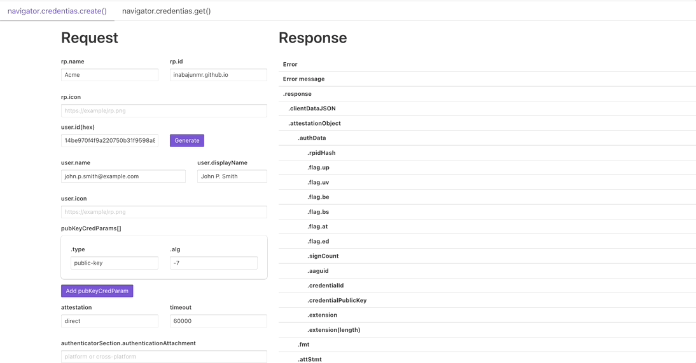

# webauthn-viewer

WebAuthn response viewer for learning.

https://inabajunmr.github.io/webauthn-viewer/



## Project setup
```
npm install
```

### Compiles and hot-reloads for development
```
npm run serve
```

### Compiles and minifies for production
```
npm run build
```

### Deploy to Vercel

This repository includes `vercel.json`.

Recommended Vercel project settings:

- Framework Preset: Vue
- Build Command: `npm run build`
- Output Directory: `dist`

No environment variables are required for the default Vercel deployment. The build uses `/` as the base path on Vercel and keeps `/webauthn-viewer/` for non-Vercel builds.

For WebAuthn, use the deployed Vercel hostname or your custom domain as `rpId`. Preview deployment hostnames are different from the production hostname, so passkeys created on one hostname cannot be reused on another.

### over nodejs 7
```
export NODE_OPTIONS=--openssl-legacy-provider
```
